## 代码生成器说明

### 参数界面说明

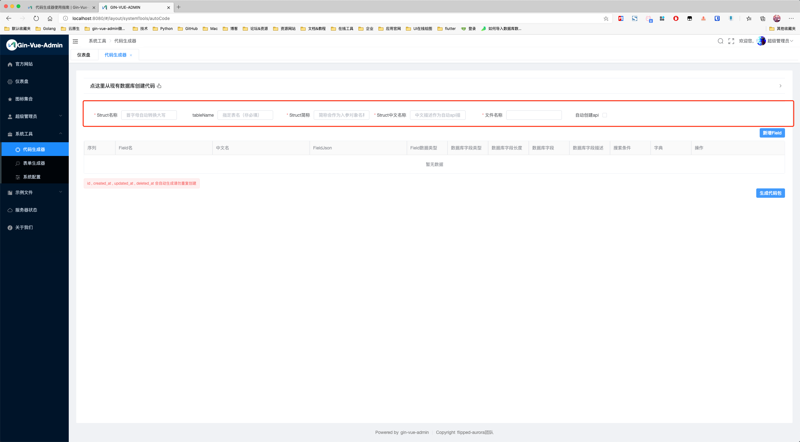

| 界面名称         | 对应生成结构体结构体名称 | 中文说明                        | 备注                                                         |
| ---------------- | ------------------------ | ------------------------------- | ------------------------------------------------------------ |
| `Struct名称`     | `StructName`             | 结构体名称                      | `server/model` 文件夹下的结构体文件中，结构体的名称，首字母必须**大写**。 |
| `tableName`      | `TableName`              | 指定表名(非必填)                | 数据库中生成的与结构体对应的数据表名。                       |
| `Struct简称`     | `PackageName`            | 简称会作为入参对象名和路由group | 用于结构体作为参数时的名称，以及路由 group 名称。这里一般与**Stuct名称**对应，但是首字母小写。 |
| `Struct中文名称` | `Abbreviation`           | 中文描述作为自动api描述         | 作为自动api描述，也是左侧菜单显示时的默认菜单名。            |
| `文件名称`       | `Description`            | 生成文件的默认名称              | 使用 xxx_xxx 形式命名。生成后端代码时，model下的文件名会用这里的命名。 |
| `自动创建api`    | `AutoCreateApiToSql`     | 自动创建api记录                 | 选中，如果不选则不会自动创建api表，需要自己去api管理里面手动增加对应路由。 |
| `自动移动文件`   | `AutoMoveFile`           | 自动移动文件                    | 自动移动到项目默认的路径                                     |

### 字段界面说明

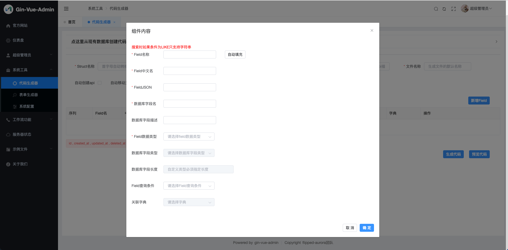

| 组件内容名称     | 对应生成结构体结构体名称 | 中文说明                 | 备注                                                         |
| ---------------- | ------------------------ | ------------------------ | ------------------------------------------------------------ |
| `Field名称`      | `FieldName`              | 结构体名称               | struct结构体中的字段名称，首字母**大写**                     |
| `Field中文名`    | `FieldDesc`              | 结构体中文名称           | 对应struct结构体tag中的comment字段值，也是数据列表展示表格的表头名称。 |
| `FieldJSON`      | `FieldJson`              | golang struct tag `json` | 对应struct结构体tag中的json字段值。在使用struct对象调用某个字段时，使用“对象.json字段值” |
| `数据库字段名`   | `ColumnName`             | 数据库字段名             | 对应数据库中的字段名称                                       |
| `数据库字段描述` | `Comment`                | 数据库备注               | 对应数据库中的列Comment值                                    |
| `Field数据类型`  | `FieldType`              | 字段对应golang数据类型   | 对应struct结构体中的字段类型                                 |
| `数据库字段类型` | `DataType`               | 字段数据类型             | 对应生成的数据表中的字段类型                                 |
| `数据库字段长度` | `DataTypeLong`           | 字段数据类型长度         | 对应生成的数据表中的字段长度                                 |
| `Field查询条件`  | `FieldSearchType`        | 搜索类型                 | 用于实现该对象数据列表的条件查询                             |
| `关联字典`       | `DictType`               | 关联字典标记             |                                                              |


## 1. 生成一步到位代码包

### 1.1 自行设计业务基础结构体模型

- 点击左侧菜单中的 **系统工具 → 代码生成器** 
- 填写好 `Struct名称` ` tableName` `Struct简称` `Struct中文名称` `文件名称` 空格
- 选择好 `自动创建api` `自动移动文件` 按钮

- 点击 **新增Field** 按钮，为数据表、struct结构体创建字段,  具体请看[字段界面说明](#字段界面说明)。

### 1.2 从数据库的选择表进行生成结构体

- 点击左侧菜单中的**系统工具** > **代码生成器** ,代码生成器是用来生成CURD代码的。

- 点击 **点这里从现有数据库创建代码**

- 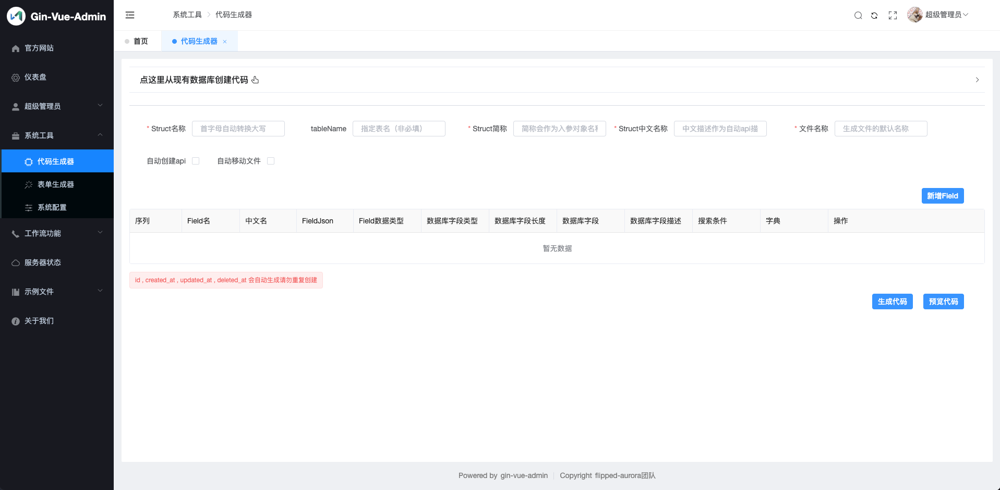

- 选择 **数据库名** 以及 **表名**

- 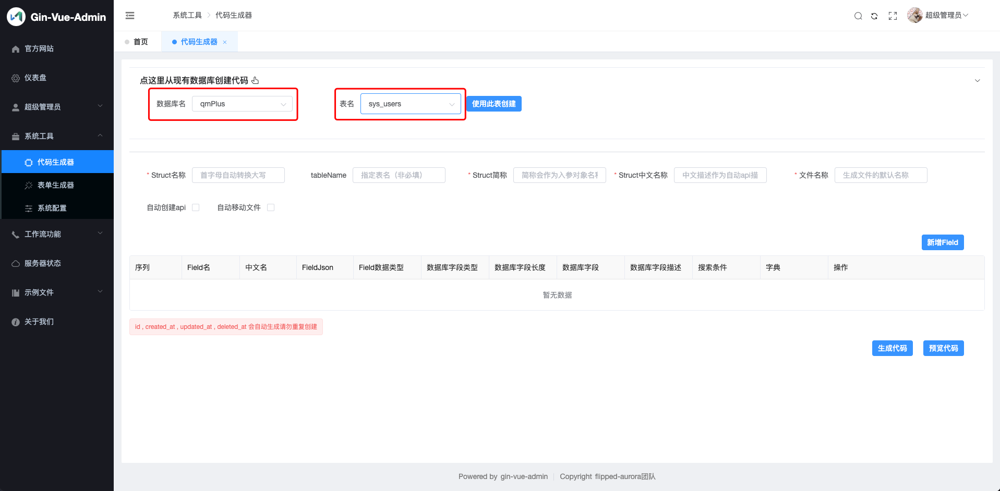

- 点击**使用此表创建**

- 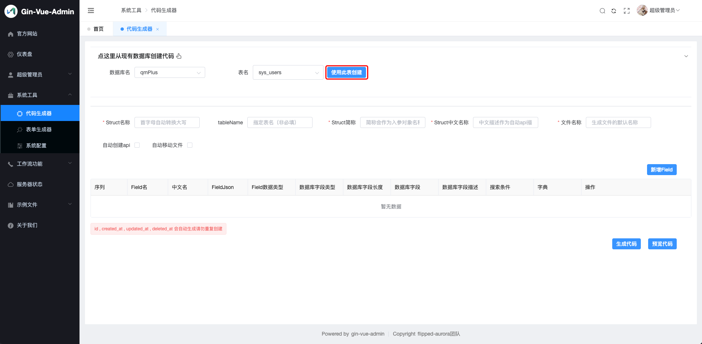

- 自行编辑好各个`Filed`的所需的搜索条件, 需要关联的字典, 或者其他自己要修改的地方点击编辑进行修改.

- 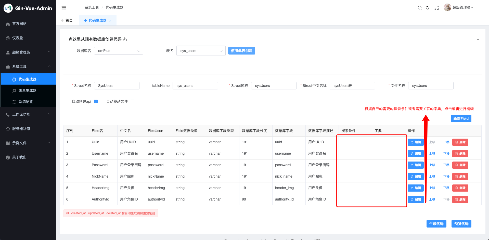

  


### 1.3  点击生成代码按钮

:::info 注意

完成1.1或1.2步骤操作, 其中一个操作喔!

:::

- 点击后就可以看到左下角或者下载内容里有一个下载好了的`generate.zip `文件

- 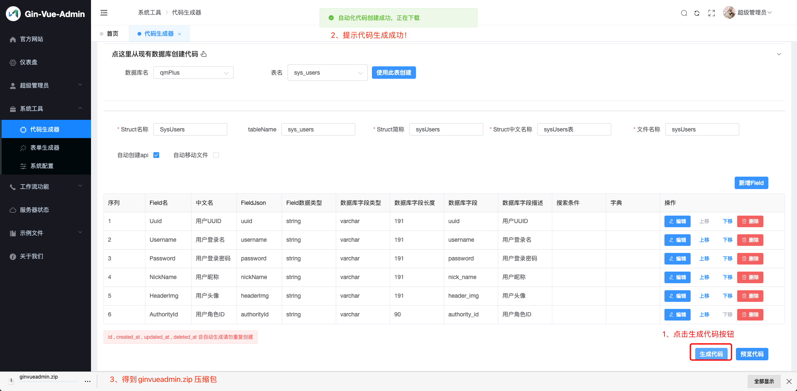

 解压 `generate.zip` 后会看到里面有个 autoCode 文件夹，autoCode 里的 `server` 文件夹为自动生成的后端代码，`web` 文件夹为自动生成的前端代码。

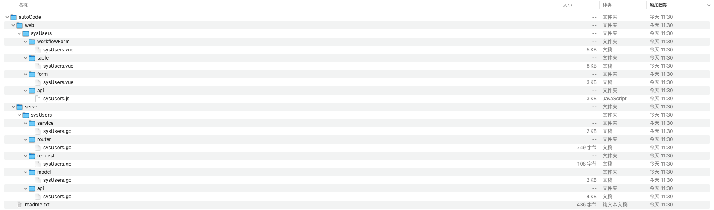

:::info 注意

[PackageName](#packagename) (文件夹自建）--> 代表图片上的sysUsers

:::

| 图片路径                                         | 移动到对应路径 (web/view/sysUsers目录下的sysUsers文件夹需要自己新建) |
| ------------------------------------------------ | ------------------------------------------------------------ |
| `autoCode/server/sysUsers/service/sysUsers.go`   | `server/app/service/sysUsers.go`                             |
| `autoCode/server/sysUsers/router/sysUsers.go`    | `server/router/sysUsers.go`                                  |
| `autoCode/server/sysUsers/request/sysUsers.go`   | `server/app/api/request/sysUsers.go`                         |
| `autoCode/server/sysUsers/model/sysUsers.go`     | `server/app/model/sysUsers.go`                               |
| `autoCode/server/sysUsers/api/sysUsers.go`       | `server/app/api/sysUsers.go`                                 |
| `autoCode/web/sysUsers/workflowForm/sysUsers.go` | `web/src/view/sysUsers/sysUsersWorkflowForm.go`<br /> (文件需要重命名, 此文件服务于工作流模板) |
| `autoCode/web/sysUsers/table/sysUsers.go`        | `web/src/view/sysUsers/sysUsers.go`                          |
| `autoCode/web/sysUsers/form/sysUsers.go`         | `web/src/view/sysUsers/sysUsersForm.go` (文件需要重命名)     |
| `autoCode/web/sysUsers/api/sysUsers.go`          | `web/src/api/sysUsers.go`                                    |

### 1.4 预览代码

:::info 注意

此功能需要在 [v2.3.9](https://github.com/flipped-aurora/gin-vue-admin/tree/v2.3.9) 之后的版本才会有喔, 不包含v2.3.9!

:::

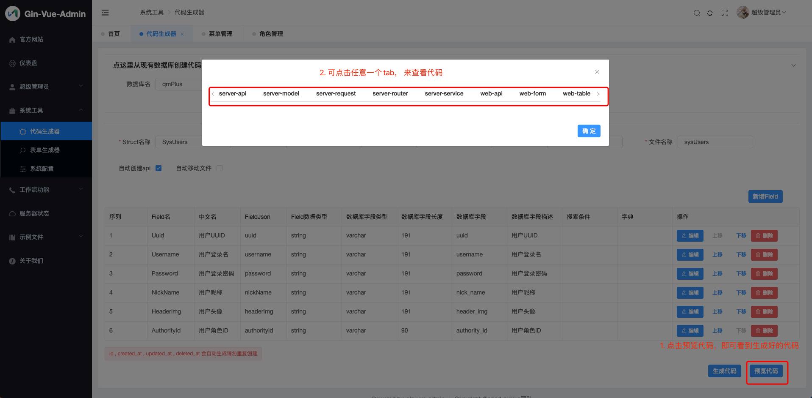

- 效果预览
- 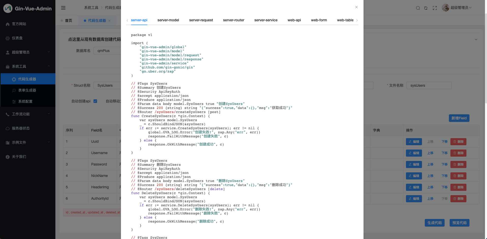

### 1.5 自动移动文件

- 操作指引

- 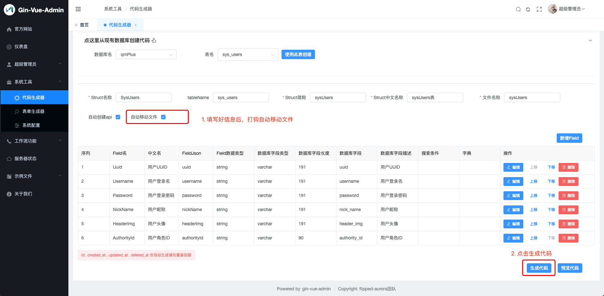

- 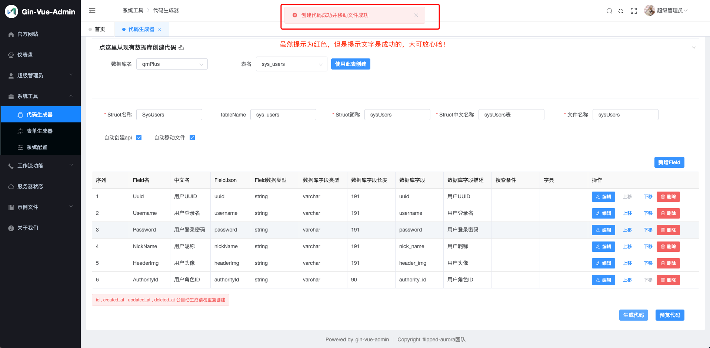

- 芜湖,起飞!!!!!! 这样不用手动去解压文件和移动文件, 太舒服了!
  
- 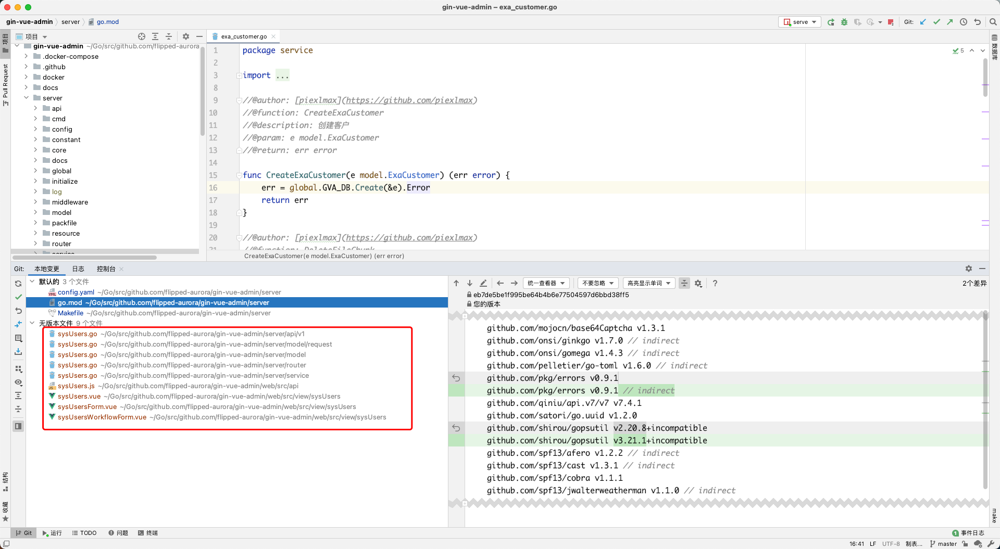

## 2. 注册路由和数据库表

### 2.1 注册路由

[server/router/router.go](https://github.com/flipped-aurora/gf-vue-admin/blob/master/server/router/router.go)

```go
package router

import (
	"github.com/gogf/gf/frame/g"
)

var Routers = new(routers)

type routers struct{}

func (r *routers) Init() {
	public := g.Server().Group("")
	{
		NewBaseGroup(public).Init()
		// 不需要鉴权的路由在这里行代码下面写
		NewSysUsersRouter(public).Init() // 此代码为示范
	}
	private := g.Server().Group("").Middleware(JwtAuth, CasbinRbac)
	{ // 需要Jwt鉴权, casbin鉴权
		NewApiRouter(private).Init()
		NewAdminRouter(private).Init()
		NewMenuRouter(private).Init()
		NewConfigRouter(private).Init()
		NewCasbinRouter(private).Init()
		NewGenerateRouter(private).Init()
		NewAuthorityRouter(private).Init()
		NewDictionaryRouter(private).Init()
		NewJwtBlacklistRouter(private).Init()
		NewOperationRecordRouter(private).Init()
		NewDictionaryDetailRouter(private).Init()

		NewFileRouter(private).Init()
		
		// 需要鉴权的路由在这里行代码下面写
		NewSysUsersRouter(private).Init() // 此代码为示范
	}
}
```

### 2.2 注册数据库表

[server/boot/gorm.go](https://github.com/flipped-aurora/gf-vue-admin/blob/master/server/boot/gorm.go)

```go
package boot

import (
	"database/sql"
	extra "gf-vue-admin/app/model/extra"
	system "gf-vue-admin/app/model/system"
	"gf-vue-admin/boot/internal"
	"gf-vue-admin/library/config"
	"gf-vue-admin/library/global"
	"github.com/gogf/gf/frame/g"
	"gorm.io/driver/mysql"
	"gorm.io/gorm"
	"os"
)

var Gorm = new(_gorm)

type _gorm struct{}

func (g *_gorm) Initialize() {
	switch global.Config.System.DbType {
	case "mysql":
		Mysql.Initialize()
	}
}
//@author: [SliverHorn](https://github.com/SliverHorn)
//@description: gorm 同步模型 生成mysql表
func (m *_mysql) AutoMigrateTables() {
	m.err = m.db.AutoMigrate(
		new(system.Api),
		new(system.Admin),
		new(system.Menu),
		new(system.Authority),
		new(system.Dictionary),
		new(system.JwtBlacklist),
		new(system.DictionaryDetail),
		new(system.MenuParameter),

		new(extra.File),
		new(extra.SimpleUploader),
		new(extra.BreakpointContinue),
		new(extra.BreakpointContinueChunk),
    
		// 在这里写模型的代码, 
		model.SysUsers{}, // 此代码为示范
		// 或者这样写, 根据自己的喜欢进行选择
		new(model.SysUser), // 此代码为示范
	)
	if m.err != nil {
		g.Log().Error(`注册表失败!`, g.Map{"err": m.err})
		os.Exit(0)
	}
	g.Log().Info(`注册表成功!`)
}
```

## 3.配置目录菜单

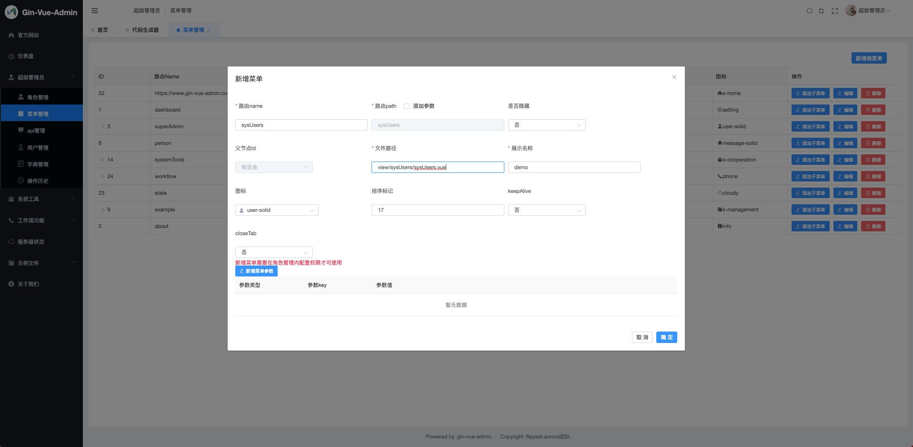

进入系统 超级管理员 → 菜单管理 菜单，点击 **新增根菜单** 按钮，配置菜单信息。

- 路由name：对应进入列表显示页面时的访问路径
- 路由path：选中后边的“添加参数”后才可以输入，对应进入列表显示页面时访问路径后的参数,具体使用方式看[视频](https://www.bilibili.com/video/BV1jk4y127yg)
- 是否隐藏：是否在系统左侧目录菜单显示时，隐藏掉该目录菜单
- 父节点Id：该目录菜单的父级目录菜单。这里是自动填充的数据，不需要自己操作
- 文件路径：对应前端项目中 /view/ [PackageName](#packagename) (自建)/[StructName](#structname).vue 文件
- 展示名称：该目录菜单显示在系统左侧目录菜单中的名称
- 图标：该目录菜单显示在系统左侧目录菜单中的图标
- 排序标记：用于调整该目录菜单在系统左侧目录菜单中显示的上下位置
- keepAlive：是否使用keepAlive缓存

以上配置好后，点击 **确定** 按钮，完成菜单配置。

## 4.配置后端接口

如果在第一步的`自动创建api`打钩了即可跳过此步

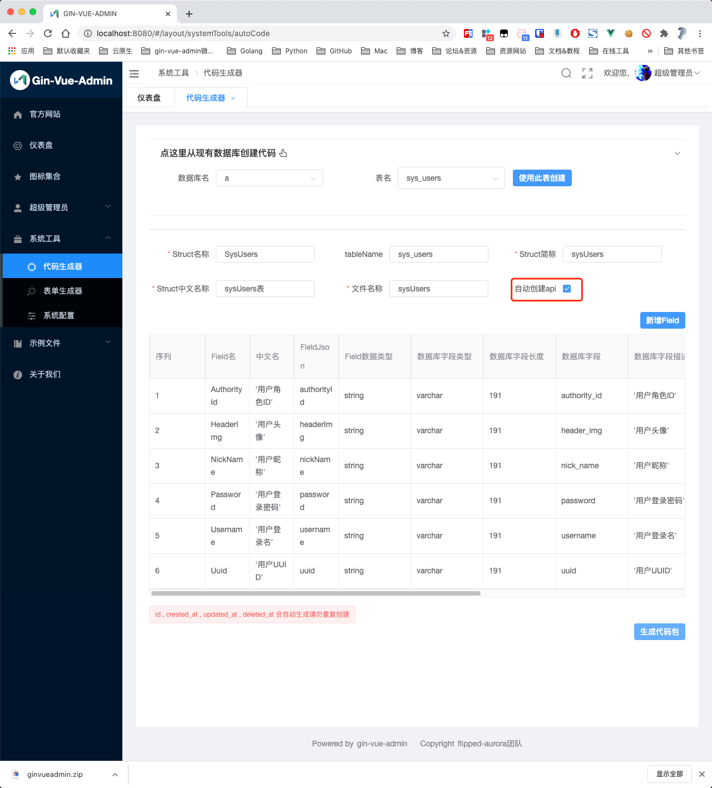

如果是自己写的业务代码，这里需要配置好后端接口。进入系统 `超级管理员` → api管理 菜单，点击 **新增api** 按钮，配置接口信息。

:::info 注意

如果不知道怎么写,可以看看 [代码](https://github.com/flipped-aurora/gf-vue-admin/blob/master/server/app/service/system/generate.go#L165) 

```go
//@author: [SliverHorn](https://github.com/SliverHorn)
//@description: 自动创建api数据
func (s *generate) AutoCreateApis(info *model.AutoCode) error {
	apis := []model.Api{
		{Path: "/" + info.Abbreviation + "/" + "create", Method: "POST", ApiGroup: info.Abbreviation, Description: "新增" + info.Description},
		{Path: "/" + info.Abbreviation + "/" + "first", Method: "GET", ApiGroup: info.Abbreviation, Description: "根据ID获取" + info.Description},
		{Path: "/" + info.Abbreviation + "/" + "update", Method: "PUT", ApiGroup: info.Abbreviation, Description: "更新" + info.Description},
		{Path: "/" + info.Abbreviation + "/" + "delete", Method: "DELETE", ApiGroup: info.Abbreviation, Description: "删除" + info.Description},
		{Path: "/" + info.Abbreviation + "/" + "deletes", Method: "DELETE", ApiGroup: info.Abbreviation, Description: "批量删除" + info.Description},
		{Path: "/" + info.Abbreviation + "/" + "getList", Method: "GET", ApiGroup: info.Abbreviation, Description: "获取" + info.Description + "列表"},
	}
	return g.DB().Transaction(func(tx *gdb.TX) error {
		for _, v := range apis {
			var entity model.Api
			if errors.Is(tx.Table(entity.TableName()).Where(g.Map{"path": v.Path, "method": v.Method}).Struct(&entity), sql.ErrNoRows) {
				if _, err := tx.Table(entity.TableName()).Insert(&v); err != nil { // 遇到错误时回滚事务
					return err
				}
			}
		}
		return nil
	})
}
```

:::

- 路径：就是接口路径，比如前端项目中 src → api → [PackageName](#packagename) .js 每个方法里的 url
- 请求：根据接口实际选择即可
- api分组：对应 struct 简称
- api简介：对api的简要说明

以上配置好后，点击 **确定** 按钮，完成接口配置。

## 5.配置角色权限

- 进入系统 `超级管理员` → `角色管理` 菜单，找到需要设置权限的角色，点击对应的 **设置权限** 按钮，配置角色相关权限。

- 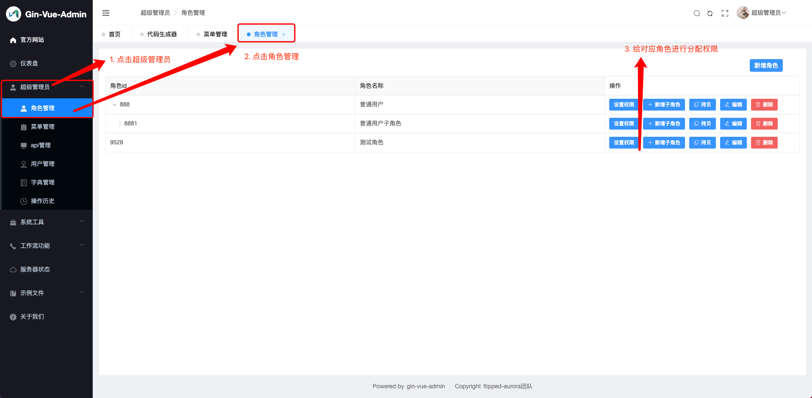

- 角色菜单：勾选该角色可以访问的目录菜单
- 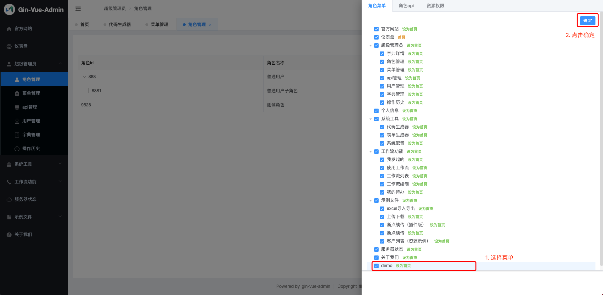
- 角色api：勾选该角色可以访问的接口
- 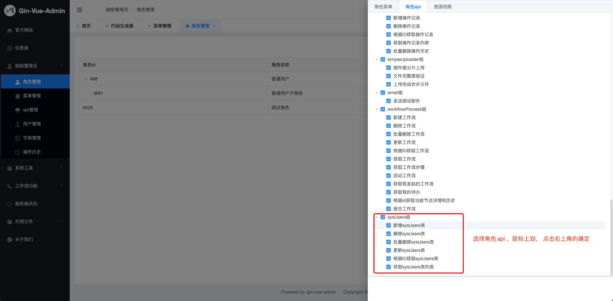

## Finish

至此，一个单表基本业务结构体的数据列表显示，单表数据增加、删除、查找、更新功能全部搞定。


