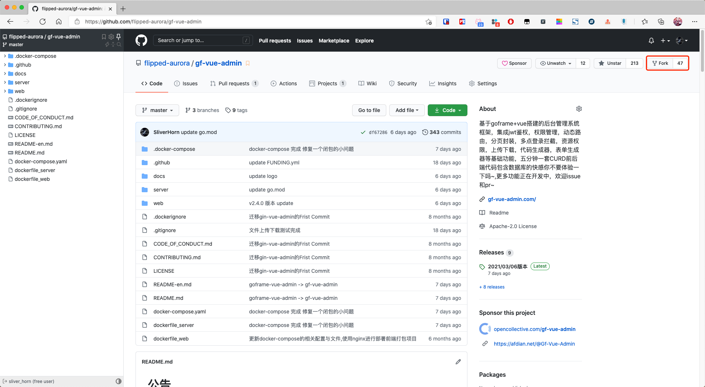
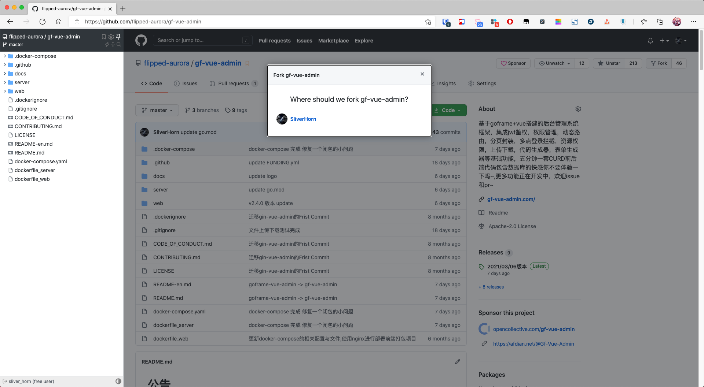
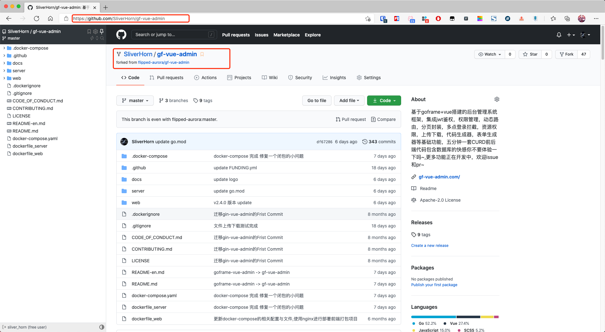
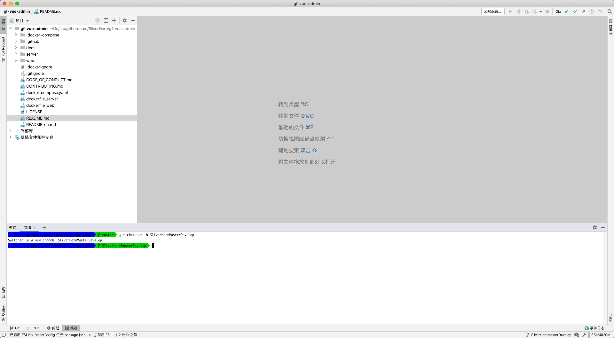
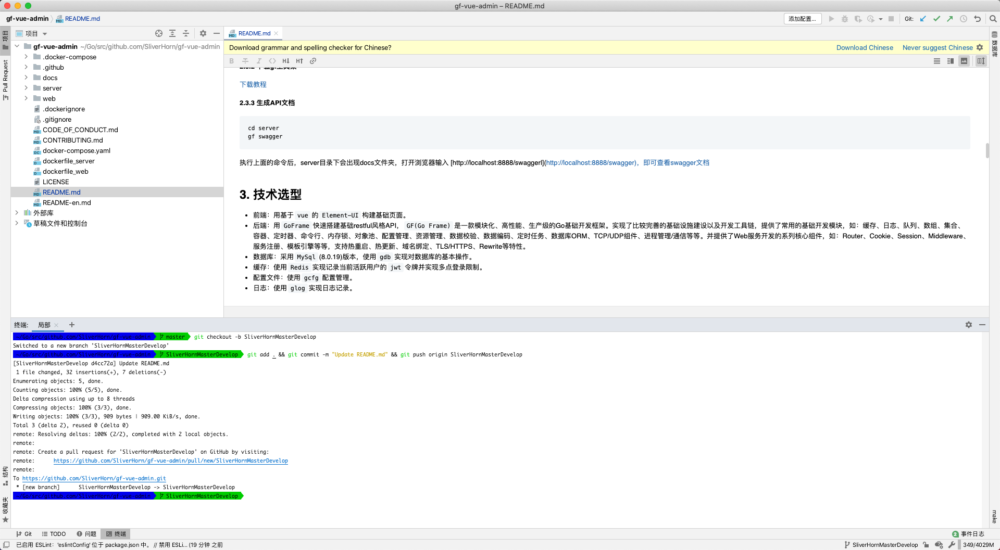
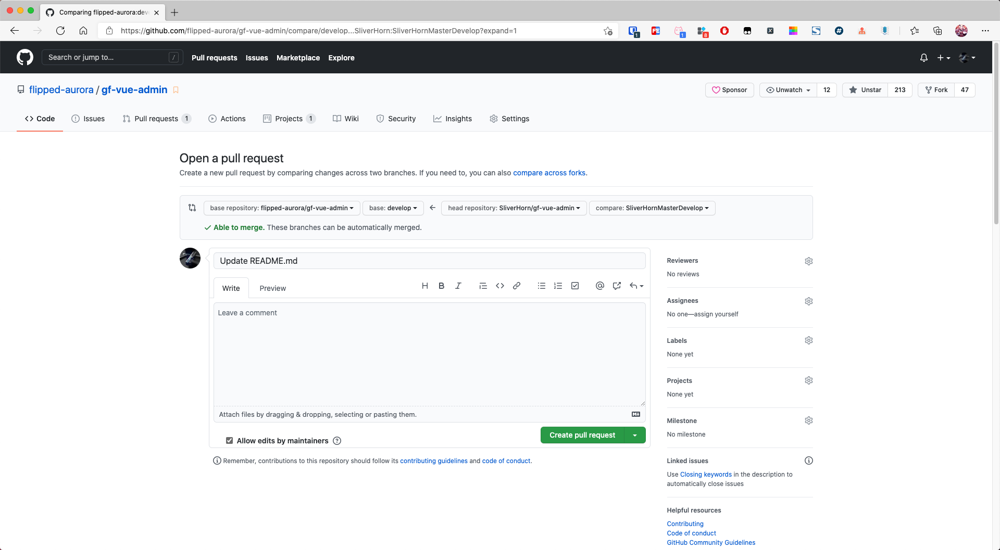
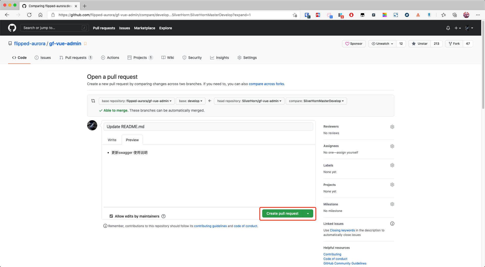
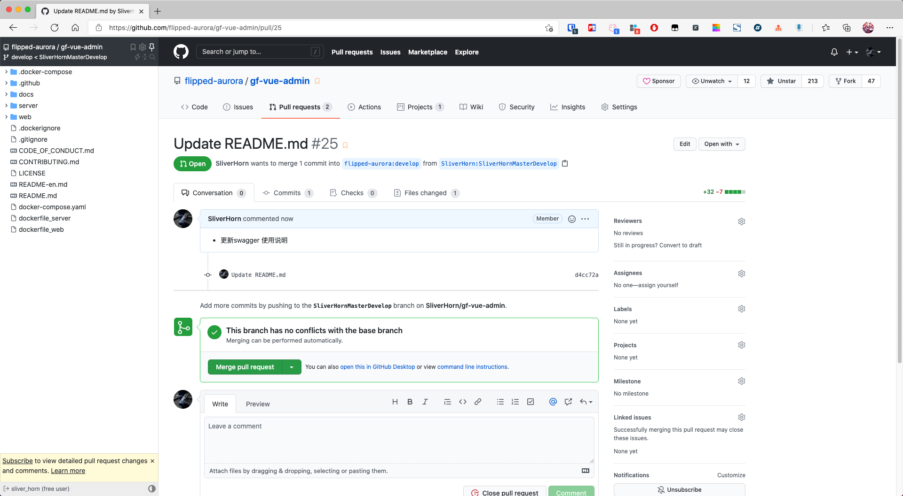

## 1. Pull Requests

### 1.1 fork gf-vue-admin repository

首先先fork源仓库



###  1.2 fork with you github name

选择fork到那个用户或者组织(点自己用户名)



### 1.3 fork success

成功! 此时您可以看到地址栏上是 https://github.com/SliverHorn/gf-vue-admin 这是SliverHorn 的 gf-vue-admin , 仓库名下方有原仓库的链接地址.



### 1.4 clone warehouse

克隆当前仓库

```shell
git clone https://github.com/SliverHorn/gf-vue-admin.git
```

### 1.5 checkout branch

建议基于某个开发分支 进行新建一个分支, 

```shell
# SliverHornMasterDevelop 为自定义分支名
git checkout -b SliverHornMasterDevelop
```



### 1.6 change you content and git commit you content

修改代码并提交你所需修改的地方

```shell
git add .
git commit -m "提交信息"
git push origin SliverHornMasterDevelop
```



### 1.7 pulls

此时你会看到有一个链接 格式为 `https://github.com/你的用户名/gf-vue-admin/pull/new/你的分支名`  ,点击即可跳转到github进行pr.

### 1.8 web pulls setting

设置你需要提交的分支

- `base repository` : 提交到的源仓库

- `base` : 提交到 `base repository` 的哪一个分支
- `head repository` : 我的fork源仓库
- `compare` : 选择修改并提交的分支



`Write` : 这里写的是代码需要注意的点以及说明

`Preview`: 预览你在 `Write` 写的 `markdown` 效果

### 1.9 create pull request

- 点击 `create pull request` 绿色按钮

	

- 当你看到以下画面便说明你提交 `create pull request` 成功了!

	

## 2. Git Fork Synchronize

Git fork 仓库代码后与其同步更新

### 2.1 repo details

```
# 首先查看是否建立了主repo的远程源
git remote -v
```

### 2.2 add repo

- main： 一个本地别名(自己定义)
- 关联地址: 后边的仓库地址，就是fork 别人的仓库地址

```shell
# 添加主repo的源
git remote add main 关联地址
```

### 2.3 check

```shell
# 查看是否添加上
git remote -v
```

### 2.4 get code

```shell
# 获取远程的资源
git fetch main
```

### 2.5 merge

- main: 一个本地别名(上面定义)

- master: 需要合并那个分支代码

```shell
git merge main/master
```

### 2.6 delete repo

```shell
# 如果要删除同步源，执行`git remote rm [本地别名]`
git remote rm main
```


### 